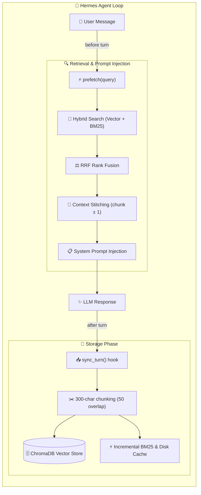

# 🐾 Mihaji Memory

<p align="center">
  
  
  
  
</p>

<p align="center">
  <strong>ChromaDB Vector + BM25 Hybrid MemoryProvider Plugin for Hermes Agent</strong><br>
  Multilingual Semantic Search · RRF Fusion · A-Res Weighted Sampling · Context Chunk Stitching · Zero-Lag Incremental Cache
</p>

<p align="center">
  <a href="README.md">🇨🇳 中文说明</a> ｜ 🇺🇸 <b>English</b>
</p>

---

## 🌟 Key Features

- 🧠 **Dual-Track Hybrid Search (Vector + BM25 + RRF)**:
  Combines **ChromaDB dense multilingual embeddings** (semantic recall) with **Jieba BM25 sparse keywords** (exact entity matching), unified via **Reciprocal Rank Fusion (RRF)**.
- ⚡ **Two-Pass Prefetch & A-Res Weighted Recall**:
  Automatically injects context before each turn: **Top-3 relevant + Top-2 strength-weighted recall (A-Res algorithm with w² bias)**, balancing precision and serendipity.
- 🧵 **Automatic Context Chunk Stitching**:
  When multi-chunk documents are matched, neighboring chunks (`chunk_idx ± 1`) are seamlessly stitched together, avoiding fragmented sentences.
- 🚀 **BM25 Disk Caching & Incremental Updates**:
  Tokenized indices are persisted to `bm25_cache.json`. New memories are incrementally appended without blocking user interactions.
- 🧹 **Active Memory Management & Offline Consolidation**:
  - `mihaji_memory` tool: `remember`, `search`, `delete`, and `count`.
  - Offline `maintenance.py` script: noise filtering, cross-bucket Jaccard deduplication, and JSON backups.
- 🛡️ **Opinionated Zero-Config**:
  Well-balanced defaults built-in. No complex parameter tuning needed.

---

## 🏗️ Architecture & Data Flow



---

## 🛠️ Tool Usage (`mihaji_memory`)

| Action | Description | Parameters | Use Case |
|:---|:---|:---|:---|
| **`search`** | Search memory | `query`, `limit` (default 5) | *"Find notes about mango sticky rice"* |
| **`remember`** | Store important facts | `text`, `strength` (1-100), `memory_type`, `tags` | *"Remember user moved to Shanghai"* |
| **`delete`** | Delete outdated memories | `query`, `doc_id`, or `group_id` | *"Remove memory about old address"* |
| **`count`** | Count stored chunks | none | Check total memory items |

---

## 📦 Installation & Quickstart

### 1. Clone the repository

```bash
git clone https://github.com/Miyamiz39/mihaji-memory.git
cd mihaji-memory
```

### 2. Symlink to Hermes plugins

```bash
ln -s $(pwd)/mihaji ~/.hermes/plugins/mihaji
```

### 3. Install dependencies

```bash
uv pip install -r requirements.txt --python ~/.hermes/hermes-agent/venv/bin/python3
```

### 4. Activate in config.yaml

```yaml
memory:
  provider: mihaji
```

> [!IMPORTANT]
> **Pinned Embedding Model & Direct Local Inference Architecture**:
> - **Standardized Multilingual Model**: Strictly pinned to `paraphrase-multilingual-MiniLM-L12-v2` (118M parameters, supporting 50+ languages with state-of-the-art multilingual semantic alignment).
> - **Direct Host Inference**: Bypasses ChromaDB's internal blackbox networking. Vectors are computed directly in Python via local disk snapshots (`local_files_only=True`), turning ChromaDB into a 100% offline local vector index.
> - **Zero-Timeout Guarantee**: Features asynchronous background warmup and instant BM25 fallback (<2ms) on cold start, completely preventing gateway 8.0s timeout drops.

Restart Hermes and verify:
```bash
hermes memory status
```

---

## 🐾 Credits & License

Built with ❤️ by **Miyamiz39 & Hina** (Beijing, 2026).
Licensed under the [MIT](LICENSE) License.
