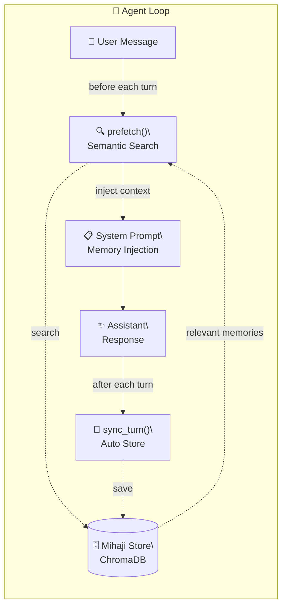

# 🐾 mihaji-memory

**ChromaDB-backed multilingual semantic memory plugin for [Hermes Agent](https://hermes-agent.nousresearch.com).**

一个轻量、本地、多语言的语义记忆插件。自动记录对话、实时语义检索、零网络依赖。

> Built with Hermes by Miyamiz

[🇨🇳 中文](README.md) ｜ 🇺🇸 English

---

### What is this?

mihaji-memory is a **MemoryProvider plugin for Hermes Agent** that uses ChromaDB for vector storage and sentence-transformers for multilingual semantic search.

Unlike MCP-based memory tools, it leverages Hermes' `system_prompt_block()` mechanism to **automatically retrieve relevant memories and inject them into the system prompt before every turn**.

### Key Advantages

| Feature | mihaji-memory | MCP-based Memory |
|---------|:-------------:|:----------------:|
| Auto-prompt injection | ✅ Built-in | ❌ Manual call |
| Auto-log conversations | ✅ sync_turn hook | ❌ Manual |
| Semantic search (CN/JP/EN) | ✅ multilingual | ✅ |
| Local-only | ✅ ChromaDB | ✅ |
| Deployment | ⚡ symlink + deps | 🐌 extra process |

### What You Get

Once installed, mihaji gives Hermes Agent the following capabilities:

| Capability | Mechanism | Trigger |
|:--|:--|:--|
| Semantic memory recall | `prefetch()` injects relevant memories into system prompt | Auto — before every turn |
| Manual search/add | `mihaji_memory` tool (search / add / count) | Manual — Agent can call via tool call |
| Auto-log conversations | `sync_turn` hook saves user messages to ChromaDB | Auto — after every turn |

In short, just chat with your Agent as usual — memory save and recall happen automatically. The Agent can also manually call `mihaji_memory` to search for specific content or add key information on demand.

### Installation

#### 1. Clone the repo

```bash
git clone https://github.com/Miyamiz/mihaji-memory.git
cd mihaji-memory
```

#### 2. Link into Hermes plugins directory

```bash
ln -s $(pwd)/mihaji ~/.hermes/hermes-agent/plugins/memory/mihaji
```

#### 3. Install dependencies (uv recommended)

```bash
# Required: chromadb + sentence-transformers
uv pip install chromadb sentence-transformers \
  --python ~/.hermes/hermes-agent/venv/bin/python3
```

#### 4. Activate the plugin

##### a. (Recommended) Interactive setup

```bash
hermes memory setup
```

Follow the prompts to select `mihaji` and configure db_path / model_name.

##### b. Manual config — add to ~/.hermes/config.yaml:

```yaml
memory:
  provider: mihaji

#    Optional config (omit to use defaults):
plugins:
  mihaji:
    db_path: ...
    model_name: ...
```

#### 5. Restart the gateway

```bash
hermes gateway restart
```

>
> Step 3 can also use pip: `pip install chromadb sentence-transformers`, but make sure it's installed into Hermes' venv.
> Step 4 only needs `memory.provider: mihaji`. Leave db_path and model_name empty to use defaults:

| Field | Default |
|:--|:--|
| `db_path` | `~/.hermes/profiles/<your-profile>/mihaji_memory/` (profile-aware) |
| `model_name` | `paraphrase-multilingual-MiniLM-L12-v2` |

> **First run:** ~10-15s to download & load the embedding model. Subsequent runs are instant — the model is shared across all sessions.

### Verification

After setup, run this command to check plugin status:

```bash
hermes memory status
```

If you see mihaji listed as `✅ available`, the plugin is recognized by Hermes.

You can also run `hermes doctor` for a full health check — it verifies the active memory provider.

Or start a new conversation and ask "Remember what we talked about earlier?" — if the agent recalls past discussions (via mihaji's automatic prefetch into the system prompt), everything is working 🐾

### Recommended Models

All models come from the [sentence-transformers](https://www.sbert.net/) ecosystem via HuggingFace Hub.
They are auto-downloaded on first use and cached at `~/.cache/huggingface/`.

**Multilingual (recommended for CN/JP/EN mixed use):**

| Model | Size | Notes |
|-------|:----:|:------|
| `paraphrase-multilingual-MiniLM-L12-v2` | 458MB | **Recommended** — 50+ languages, best balance for CN/JP/EN |
| `intfloat/multilingual-e5-small` | 118MB | Lightweight multilingual retrieval, faster |
| `intfloat/multilingual-e5-base` | 278MB | Mid-range speed/quality tradeoff |
| `intfloat/multilingual-e5-large` | 560MB | Highest accuracy for demanding retrieval |
| `distiluse-base-multilingual-cased-v2` | 500MB | Distilled multilingual model, slightly dated |

**English-only (lighter alternatives):**

| Model | Size | Notes |
|-------|:----:|:------|
| `all-MiniLM-L6-v2` | 90MB | Ultra-lightweight, best for English-only |
| `paraphrase-MiniLM-L3-v2` | 30MB | Extremely light, resource-constrained |
| `all-mpnet-base-v2` | 420MB | Best English accuracy |

> 💡 Browse all available models at [sentence-transformers on HuggingFace](https://huggingface.co/models?library=sentence-transformers).

---

## 🏗️ Architecture



### How It Works

1. **Prefetch** — Before each response, the user's message is used to semantically search memory (via `prefetch()`).
2. **Inject** — Matched memories are injected into the system prompt, so the agent always has context.
3. **Auto-store** — After each turn, meaningful messages (>20 chars) are automatically chunked and stored (via `sync_turn` hook).
4. **Tool access** — A `mihaji_memory` tool is also exposed for manual search/add/count.

### Chunking Strategy

Text is split into overlapping chunks (300 chars each, 50 char overlap) to preserve context across boundaries.

```
"米哈唧是清华大学的学生，在五道口上学。今天聊了..."
 ┌─────────────────────────────────────────────┐
 │ Chunk 1: ...在五道口上学。今天...  300c │
 └─────────────────────────────────────────────┘
                ┌──────────────────────────────┐
                │ Chunk 2: 道口上学。今天聊了... 300c│  ← 50 overlap
                └──────────────────────────────┘
```

---

## 📦 Project Structure

```
mihaji-memory/
├── README.md               # 中文版
├── README.en.md            # English version
├── LICENSE                 # MIT
└── mihaji/                 # Plugin directory — symlink to Hermes plugins/
    ├── __init__.py          # Plugin entry + MihajiStore export
    ├── store.py             # ChromaDB backend
    └── plugin.yaml          # Hermes plugin manifest
```

---

## 🐾 Credits

Built by **Miyamiz & Hina** — a medical student and his agent cat, chatting away in a Beijing alley at midnight.

---

## 📄 License

MIT
