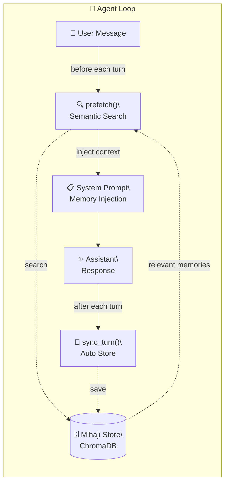

# 🐾 mihaji-memory

**ChromaDB-backed multilingual semantic memory plugin for [Hermes Agent](https://hermes-agent.nousresearch.com).**

一个轻量、本地、多语言的语义记忆插件。自动记录对话、实时语义检索、零网络依赖。

> Built with Hermes by Miyamiz

🇨🇳 中文 ｜ [🇺🇸 English](README.en.md)

---

### 这是什么？

mihaji-memory 是一个手搓的 **Hermes Agent 专用的 MemoryProvider 插件**，用 ChromaDB 做向量存储、sentence-transformers 做多语言语义搜索。

与普通的 MCP-based 记忆工具不同，它通过 Hermes 的 `system_prompt_block()` 机制，**在每轮对话开始前自动检索相关记忆并注入到系统提示中**——你不需要手动调用任何搜索工具，记忆自然出现在 Agent 的眼前。

### 核心优势

| 特性 | mihaji-memory | MCP-based 记忆 |
|------|:-------------:|:--------------:|
| 系统提示强制检索 | ✅ 自动注入 | ❌ 需要手动调工具 |
| 自动记录对话 | ✅ sync_turn 钩子 | ❌ 需要手动 |
| 语义搜索（中日英） | ✅ multilingual | ✅ |
| 本地运行 | ✅ ChromaDB | ✅ |
| 部署复杂度 | ⚡ 软链 + 装依赖 | 🐌 需要额外进程 |

### 提供的能力

安装激活后，mihaji 会为 Hermes Agent 提供以下能力：

| 能力 | 机制 | 触发方式 |
|:--|:--|:--|
| 语义记忆检索 | `prefetch()` 自动将相关记忆注入系统提示 | 自动 —— 每轮对话前 |
| 手动搜索/添加 | `mihaji_memory` 工具（search / add / count） | 手动 —— Agent 可通过 tool call 调用 |
| 对话自动记录 | `sync_turn` 钩子将用户消息存入 ChromaDB | 自动 —— 每轮对话后 |

简单来说，用户和 Agent 正常聊天就好——记忆的存取都是自动的。Agent 也可以在需要时手动调 `mihaji_memory` 工具来搜索特定内容或手动添加关键信息。

### 安装

#### 1. 克隆仓库

```bash
git clone https://github.com/Miyamiz39/mihaji-memory.git
cd mihaji-memory
```

#### 2. 放入 Hermes 插件目录

```bash
ln -s $(pwd)/mihaji ~/.hermes/hermes-agent/plugins/memory/mihaji
```

#### 3. 安装依赖（推荐 `uv`）

```bash
#    需要：chromadb + sentence-transformers
uv pip install chromadb sentence-transformers \
  --python ~/.hermes/hermes-agent/venv/bin/python3
```

#### 4. 激活插件

##### a. (推荐)交互式配置

```bash
hermes memory setup
```
进入 Hermes 自带的 Memory 交互式配置界面，选择 `mihaji`，按提示配置 db_path 和 model_name。

##### b. 手动配置 —— 在 ~/.hermes/config.yaml 中添加：

```yaml
memory:
  provider: mihaji

#    可选配置（留空则用上面的默认值）：
plugins:
  mihaji: 
    db_path: ...
    model_name: ...
```

#### 5. 重启 gateway

```bash
hermes gateway restart
```

>
> 第 3 步也可以用 pip：`pip install chromadb sentence-transformers`，但请确保装到 Hermes 的 venv 里。
> 第 4 步只需一行 `memory.provider: mihaji`，db_path 和 model_name 留空则自动使用默认值：

| 字段 | 默认值 |
|:--|:--|
| `db_path` | `$HERMES_HOME/mihaji_memory`（profile 感知） |
| `model_name` | `paraphrase-multilingual-MiniLM-L12-v2` |

**首次启动注意：** 加载模型需要约 10-15 秒（下载 + 加载），之后所有 sessions 共享同一份模型缓存，速度极快。

### 安装后验证

装完后跑以下命令确认插件状态：

```bash
hermes memory status
```

如果输出中能看到 mihaji 显示为 `✅ available`，说明插件已被 Hermes 识别。

也可以跑 `hermes doctor` 来全面检查——它会检测活跃记忆提供商是否正常。

### 模型选择指南

所有模型均来自 [sentence-transformers](https://www.sbert.net/) 生态 + HuggingFace Hub。
首次使用时会自动下载，之后缓存到 `~/.cache/huggingface/`。

**多语言（中日英混合推荐）：**

| 模型 | 大小 | 说明 |
|------|:----:|:------|
| `paraphrase-multilingual-MiniLM-L12-v2` | 458MB | **推荐** — 50+ 语言，中日英语义搜索的最佳平衡点 |
| `intfloat/multilingual-e5-small` | 118MB | 轻量级多语言检索模型，速度更快 |
| `intfloat/multilingual-e5-base` | 278MB | 精度与速度的中间选择 |
| `intfloat/multilingual-e5-large` | 560MB | 精度最高，适合对检索质量要求苛刻的场景 |
| `distiluse-base-multilingual-cased-v2` | 500MB | 多语言蒸馏模型，可用但稍旧 |

**仅英文（更轻量）：**

| 模型 | 大小 | 说明 |
|------|:----:|:------|
| `all-MiniLM-L6-v2` | 90MB | 极轻量，英文场景首选 |
| `paraphrase-MiniLM-L3-v2` | 30MB | 极致轻量，资源受限环境 |
| `all-mpnet-base-v2` | 420MB | 英文精度最高，需要英文单语场景 |

> 💡 所有可用模型详见 [sentence-transformers 模型库](https://huggingface.co/models?library=sentence-transformers)，选择适合你语言场景的即可。

---

## 🏗️ Architecture



### How It Works

1. **Prefetch** — Before each response, the user's message is used to semantically search memory (via `prefetch()`).
2. **Inject** — Matched memories are injected into the system prompt, so the agent always has context.
3. **Auto-store** — After each turn, meaningful messages (>20 chars) are automatically chunked and stored (via `sync_turn` hook).
4. **Tool access** — A `mihaji_memory` tool is also exposed for manual search/add/count.

### Chunking Strategy

Text is split into overlapping chunks (300 chars each, 50 char overlap) to preserve context across boundaries.

```
"米哈唧是清华大学的学生，在五道口上学。今天聊了..."
 ┌─────────────────────────────────────────────┐
 │ Chunk 1: ...在五道口上学。今天...  300c │
 └─────────────────────────────────────────────┘
                ┌──────────────────────────────┐
                │ Chunk 2: 道口上学。今天聊了... 300c│  ← 50 overlap
                └──────────────────────────────┘
```

---

## 📦 Project Structure

```
mihaji-memory/
├── README.md               # This file
├── README.en.md            # English version
├── LICENSE                 # MIT
└── mihaji/                 # Plugin directory — symlink to Hermes plugins/
    ├── __init__.py          # Plugin entry + MihajiStore export
    ├── store.py             # ChromaDB backend
    └── plugin.yaml          # Hermes plugin manifest
```

---

## 🐾 Credits

Built by **Miyamiz & Hina** — a medical student and his agent cat, chatting away in a Beijing alley at midnight.

---

## 📄 License

MIT
