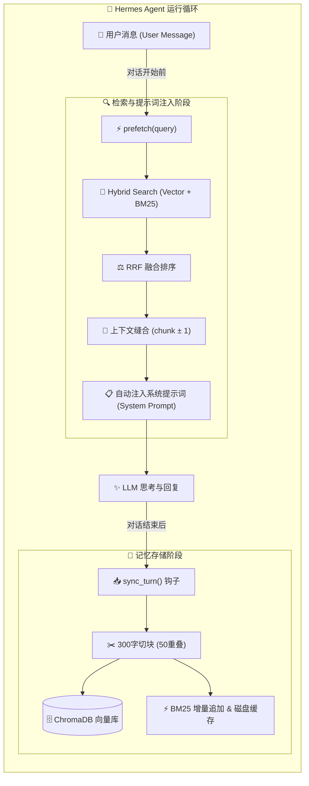

# 🐾 Mihaji Memory (米哈唧记忆)

<p align="center">
  
  
  
  
</p>

<p align="center">
  <strong>基于 ChromaDB 向量 + BM25 关键词双轨混合检索的 Hermes Agent 原生持久化记忆插件</strong><br>
  中日英多语言支持 · RRF 融合重排 · A-Res 加权采样 · 上下文自动缝合 · 毫秒级增量缓存 · 零配置开箱即用
</p>

<p align="center">
  🇨🇳 <b>中文说明</b> ｜ <a href="README.en.md">🇺🇸 English</a>
</p>

---

## 🧩 两种实现：按你的平台选

本仓库同时维护 **mihaji 的两个实现**，机制同源、各自独立演进：

| | 🐍 Hermes 版（本页） | ⚡ DSH 版（dsh-mihaji） |
|---|---|---|
| 平台 | Hermes Agent（Python / ChromaDB + BM25） | DeepSeek Harness profile bundle（Node） |
| 代码目录 | `mihaji/` | `dsh-mihaji/` |
| 存储 | ChromaDB 向量库 | JSON 单文件（memory.json）+ 关键词/向量混合检索 |
| **默认嵌入模型** | fp32 PyTorch（SentenceTransformer） | **INT8 q8 ONNX 量化**（transformers.js，文件 ~113MB、进程内 ~450MB） |
| 安装 / 文档 | 按本页下方说明 | [dsh-mihaji/README.md](dsh-mihaji/README.md) |

- **用 DSH 的选 dsh-mihaji**：默认已用 q8 量化版，内存比 fp32 省一半以上，精度实测与 fp32 一致性 ≥0.992，旧 fp32 向量无需重嵌。
- **用 Hermes 的选本页版本**：默认 fp32 多语言模型（PyTorch 栈，不直接复用 ONNX q8；需要低内存可自行走 optimum/onnxruntime 路线）。
- DSH 移植的架构与决策记录见 `docs/dsh-port-design.md`。

---

## 🌟 核心特性

- 🧠 **双轨混合检索 (Hybrid Search + RRF)**：
  结合 **ChromaDB 多语言稠密向量**（语义联想）与 **Jieba BM25 稀疏关键词**（精准专有名词匹配），通过 **RRF (Reciprocal Rank Fusion)** 无监督融合排序，召回质量兼顾语义与精确命中。
- ⚡ **两段式自动注入 (Two-Pass Prefetch & A-Res Sampling)**：
  每轮对话前，底层自动执行两段式检索：**Top-3 精准命中 + Top-2 记忆强度加权采样（A-Res 算法，w² 平方加权）**，既保证关键事实不遗忘，又避免每轮看到机械重复的上下文。
- 🧵 **上下文前后自动缝合 (Context Chunk Stitching)**：
  多分块长记忆在检索命中时，自动回溯并无缝拼接相邻的 `chunk_idx ± 1` 片段，杜绝断句断意。
- 🚀 **BM25 磁盘缓存与增量更新 (Zero-Lag Indexing)**：
  分词语料与倒排索引自动持久化为 `bm25_cache.json`；新记忆存入时仅对新块做增量分词追加，彻底消除每轮对话全量扫描带来的 1~2 秒主线程卡顿。
- 🧹 **主动管理与离线睡眠巩固 (CRUD & Maintenance)**：
  - Agent 交互工具：`remember`（主动存储）、`search`（精准查询）、`delete`（语义/ID遗忘纠错）、`count`（条目统计）。
  - 离线巩固脚本 `maintenance.py`：超短噪音清洗、跨桶 Jaccard 相似度去重、JSON 全量备份。
- 🛡️ **极简与克制 (Opinionated Zero-Config)**：
  固化科学的数学级差与最优超参数，开箱即用，无需用户纠结调参。

---

## 🏗️ 架构与数据流



---

## 🛠️ 工具操作指南 (`mihaji_memory`)

插件会自动为 Hermes Agent 注册 `mihaji_memory` 工具，LLM 可在需要时主动调用：

| 动作 (Action) | 说明 | 关键参数 | 示例场景 |
|:---|:---|:---|:---|
| **`search`** | 混合检索过往记忆 | `query`, `limit` (默认5) | *"搜一下用户之前提到的芒果糯米饭做法"* |
| **`remember`** | 主动记录高价值长期记忆 | `text`, `strength` (1-100), `memory_type`, `tags` | *"记住用户换到了上海工作，偏好泰餐"* |
| **`delete`** | 主动删除错误/过时的记忆 | `query`, `doc_id` 或 `group_id` | *"删除关于之前旧地址的记忆"* |
| **`count`** | 查看当前记忆库总条目数 | 无 | 统计当前记忆容量 |

> 💡 **记忆类型 (`memory_type`)** 支持：`preference`（偏好）、`knowledge`（知识）、`event`（事件）、`task`（任务）、`general`（通用）。

---

## 📦 安装与快速开始

### 1. 克隆仓库

```bash
git clone https://github.com/Miyamiz39/mihaji-memory.git
cd mihaji-memory
```

### 2. 软链接至 Hermes 插件目录

```bash
# Linux / macOS:
ln -s $(pwd)/mihaji ~/.hermes/plugins/mihaji

# Windows (PowerShell 以管理员或开发者模式运行):
# New-Item -ItemType SymbolicLink -Path "$env:LOCALAPPDATA\hermes\plugins\mihaji" -Target "$((Get-Location).Path)\mihaji"
```

### 3. 安装依赖

建议在 Hermes 的 Python 虚拟环境中安装：

```bash
# 使用 uv (推荐)
uv pip install -r requirements.txt --python ~/.hermes/hermes-agent/venv/bin/python3

# 或使用 pip (请确保处于 Hermes 的 venv 中)
pip install -r requirements.txt
```

> **PyTorch 提示**：`sentence-transformers` 依赖 PyTorch。如仅使用 CPU，可安装轻量 CPU 版：
> `pip install torch --index-url https://download.pytorch.org/whl/cpu`

### 4. 激活插件

在 `~/.hermes/config.yaml` 中配置：

```yaml
memory:
  provider: mihaji

# 可选配置（留空则自动使用默认值）：
plugins:
  mihaji:
    db_path: "" # 留空默认使用 profile 下的 mihaji_memory 目录
    model_name: "paraphrase-multilingual-MiniLM-L12-v2"
```

> [!NOTE]
> **关于嵌入模型（Embedding Model）**：
> 本插件为多语言跨会话记忆量身设计，固化选用 **`paraphrase-multilingual-MiniLM-L12-v2`**（原生支持中、日、英等 50+ 种语言）。
> 模型推理直接由应用层托管，纯本地离线运行（首次自动通过高速镜像拉取），并配备后台静默预热机制，开箱即用，无需额外配置。
> 本版为 **fp32 PyTorch** 加载；同一模型的 **INT8 q8（ONNX）量化默认版**见 DSH 实现（`dsh-mihaji/`），两版产出向量可互认。

重启 Hermes 即可生效：
```bash
hermes memory status
```

---

## 🧹 记忆睡眠巩固 (`maintenance.py`)

项目附带了离线记忆巩固脚本，建议通过 Cron 定期在夜间执行：

```bash
# 预览清理效果 (不修改数据库)
python mihaji/maintenance.py --dry-run

# 执行实际清理并自动备份
python mihaji/maintenance.py --backup-dir ~/memory-backups --min-length 20 --dedup-threshold 0.95
```

**功能说明**：
- 过滤 `< 20` 字符的无效碎语噪音；
- 基于字符二元 Jaccard 相似度跨桶合并近似重复记忆；
- 导出 JSON 结构化备份文件；
- 触发 BM25 索引自动重平衡。

---

## 🗂️ 仓库目录结构

```
mihaji-memory/
├── README.md               # 中文文档
├── README.en.md            # English Documentation
├── requirements.txt        # 运行时依赖清单
├── LICENSE                 # MIT License
├── AGENTS.md               # 架构 handoff 说明与已知问题排查
└── mihaji/                 # 插件核心代码 (对应 Hermes 插件目录)
    ├── __init__.py         # MemoryProvider 入口与 Tool Schema
    ├── store.py            # ChromaDB 存储封装、分块与上下文缝合
    ├── hybrid_search.py    # BM25 增量索引、RRF 融合与 A-Res 加权采样
    ├── maintenance.py      # 记忆维护与去重巩固脚本
    └── plugin.yaml         # Hermes 插件元数据声明
```

---

## 🐾 致谢与协议

Built with ❤️ by **Miyamiz39 & Hina** (Beijing, 2026).
本项目遵循 [MIT](LICENSE) 开源协议。
